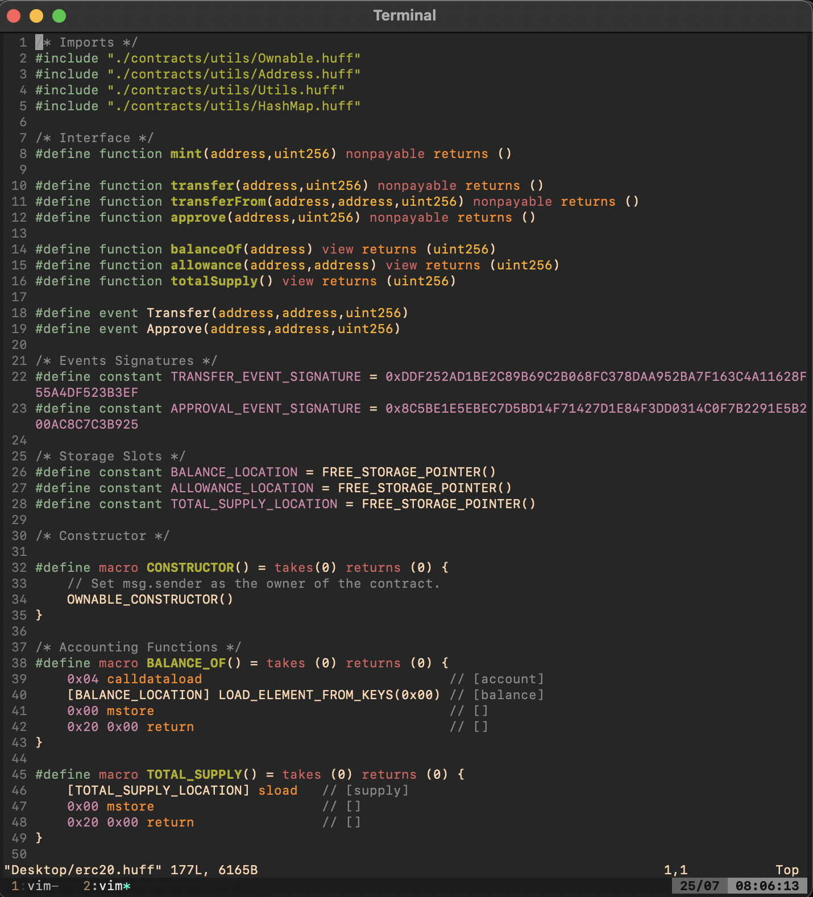

# vim-huff

[](https://www.repostatus.org/#wip)

[](https://opensource.org/licenses/MIT)


Syntax files for [Huff](https://github.com/huff-language), A low-level assembly language for Ethereum.

> **Warning**
>
> This repo contains **highly** experimental code. Expect rapid iteration.
>
> The current implementation does not currently work since environment variables are not refreshed.


## Installation

### Plug

Add the following line to your `~/.vimrc`:

```vim
Plug 'pedrommaiaa/vim-huff'
```

### Vundle

Add the following line to your `~/.vimrc`:

```vim
Plug 'pedrommaiaa/vim-huff'
```

### No Plugin Manager

Copy all of the files manually into your `~/.vim`.


## Example


